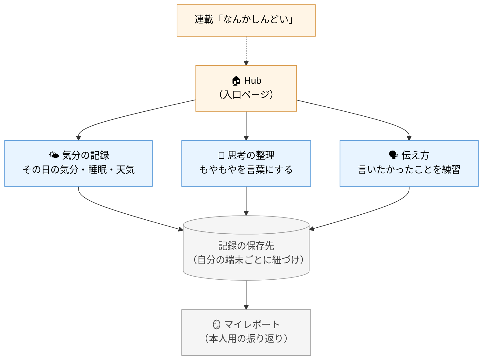

# 当事者として、自分のために作っているツール群

「なんかしんどい」という曖昧な感覚を、
記録と振り返りを通して少しずつ言葉にしていくための、
自分用のセルフケアツールを公開しています。

3つのアプリと、それらをまとめる入口（Hub）で構成されていて、
無料・登録不要・アプリ起動不要（ブラウザだけ）で使えます。

---

## なぜ作っているのか

私自身、適応障害と診断されたあとに、
「なぜ、適応障害になったのか」がわからない時期がありました。

振り返ろうとしても、自分の中で何が起きていたのかが、
うまく言葉にならない。

普段の仕事ではデータを通じて客観的に捉え直すことをしているのに、
**自分自身に対しては、客観的に見られていなかった**。
それに気づいてから、スマホのメモ帳に気分や思考を書き留めるようになりました。

ただ、メモ帳だと構造的に整理できない。
情報が日ごとに散らかって、後から振り返ろうとしても見つからない。
パターンを探すには向いていませんでした。

そこで、

- 短時間で書ける
- 後から振り返れる
- パターンが見えてくる

を満たす形にしたのが、この3つのアプリです。
いまは自分の生活の一部として日々使っていて、
連載 [「なんかしんどい」から「自分らしく歩む」まで](https://note.com/light_holly7736) の素材にもなっています。

---

## 全体像

入口の Hub から、その日に使いたいツールを選んで開きます。
書いた記録は端末ごとに紐づいた形で保存され、
3つのアプリの間で同じ「自分」として連携します。

---

## 3つのアプリ

### 🌤 気分の記録（mood tracker）

その日の気分（1〜10）、睡眠時間、出来事タグ、天気・気圧を記録します。
天気と気圧は位置情報から自動取得されるので、入力は1分かかりません。

数日分溜まると、

- 普段の気分の平均からの「いつもと違った日」（±2σ逸脱）
- 曜日ごとの傾向
- 気圧と気分の関係

が、グラフで見えるようになります。
「なんとなくしんどい日」が、データの上では確かにいつもと違う、
ということを、自分の目で確かめられる場所です。

[使ってみる](https://mood-tracker-public-exqvwdkagbgt3gk4mlmu6f.streamlit.app/)

---

### 💭 思考の整理（CBTセルフヘルプ）

頭の中でぐるぐる回っている考えを、
認知行動療法（CBT）の「7コラム法」という型に沿って整理します。

AIが対話形式で問いかけてくれるので、
白紙のノートを前にして固まる、という事態にはなりません。

- 起きた出来事
- そのときに浮かんだ自動思考
- 感じた感情と強さ
- 根拠と反証
- バランスの取れた別の見方

を順に書き出していくと、最後に**認知の歪みのパターン**が
推定されて返ってきます。
「自分はこのクセが多いな」と気づくきっかけになる場所です。

[使ってみる](https://cbt-bot-public-lxcmvrmdys9s3hfg6w2r7l.streamlit.app/)

---

### 🗣 伝え方（アサーション練習）

「言いたかったけど、言えなかった」場面を、
**アサーション**という考え方で練習する場所です。

- 何が起きたか
- 自分はどう感じたか
- 相手にどう伝えたいか

を整理したあと、AIが**3パターンの伝え方の文案**を出してくれます。
押しが弱すぎず、強すぎず、自分の感覚に合うものを選べる形です。

実際に伝えるかどうかは、もちろん自分で決めて構いません。
「伝えなかった」も含めて、振り返って次に活かす場所です。

[使ってみる](https://assertion-bot-public-7yjqhpnvshkdkj7avedrml.streamlit.app/)

---

## 共通の仕組み

- **入口は Hub**：どのアプリを使うかは入ってから決められる
- **ブラウザごとに自動でID発行**：登録もログインも不要、でも記録は自分のものとして残る
- **3アプリで同じ自分**：気分の記録と思考の整理を、同じ「自分」のデータとして見られる
- **データは外には出ない**：表示は本人と管理画面のみ、note記事に出すときも本人の判断で抜粋する形

技術的には Streamlit + Supabase で動いていますが、
使う側はそのことを意識しなくて大丈夫です。

---

## 使い方の流れ（一例）

1. 朝、気分が重いと感じた日に **🌤 気分の記録** を1分つける
2. 帰宅後、もやもやが残っていたら **💭 思考の整理** で対話する
3. 言えなかった場面があれば **🗣 伝え方** で次回の文案だけ作っておく
4. 数日〜数週間溜まったら、グラフで自分のパターンを眺めてみる

全部やる必要はなく、その日に必要なものだけ開けば十分です。

---

## これからのこと

- 記録が増えてきたら、月次の自己レポートを連載の素材にしていく予定
- 技術的な裏側（±2σ逸脱の仕組みなど）は、別途記事として書きます
- アプリ自体は当面、新規追加よりも**3つの磨き込み**を優先します

---

## リンク

| | URL |
|---|---|
| 🏠 Hub（入口） | https://app-public-qpy8b2ziwgdf9h2vmu5hqp.streamlit.app/ |
| 🌤 気分の記録 | https://mood-tracker-public-exqvwdkagbgt3gk4mlmu6f.streamlit.app/ |
| 💭 思考の整理 | https://cbt-bot-public-lxcmvrmdys9s3hfg6w2r7l.streamlit.app/ |
| 🗣 伝え方 | https://assertion-bot-public-7yjqhpnvshkdkj7avedrml.streamlit.app/ |
| 📝 note 連載 | https://note.com/light_holly7736 |

---

> セルフケアの補助ツールであって、医療行為の代わりではありません。
> しんどい時は、迷わず医療やカウンセリングを頼ってください。
