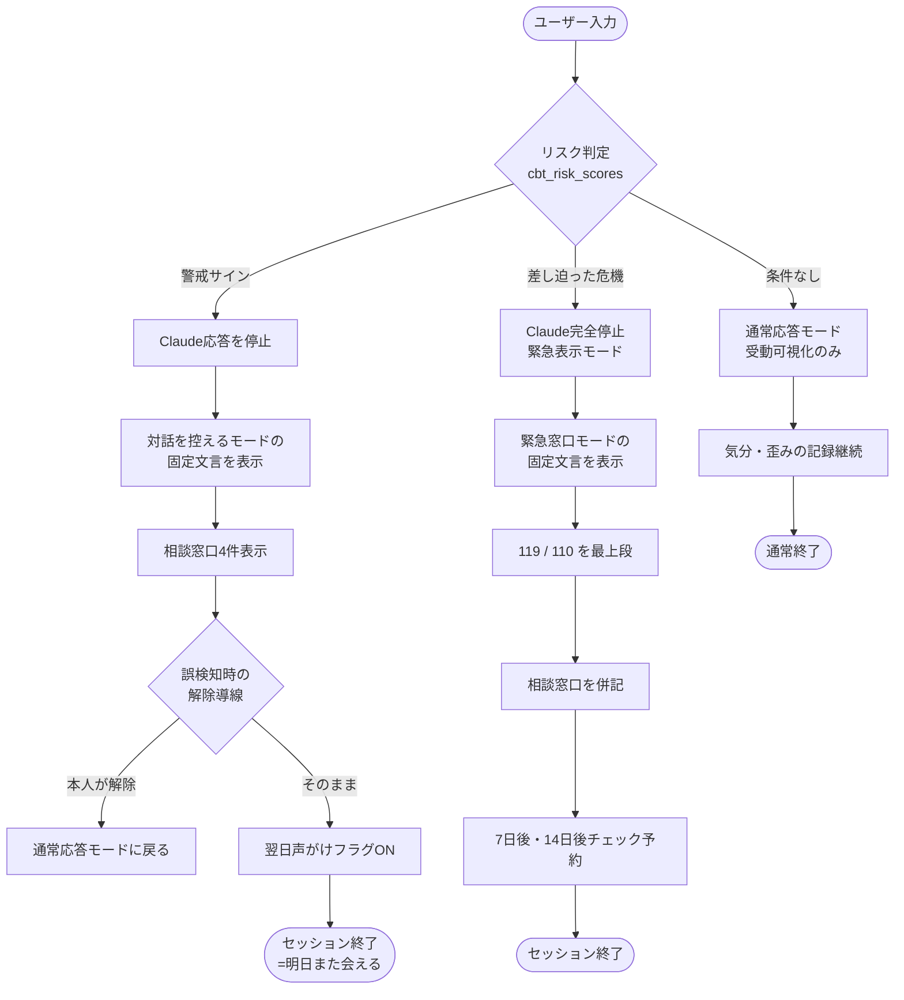

# 危機検知時のアプリ応答フロー（設計書）

最終更新日：2026-04-26
対象アプリ：cbt-bot-public（思考の整理）/ mood-tracker-public（気分の記録）/ assertion-bot-public（伝え方）

---

## ⚠️ この文書について（最初にお読みください）

本文書は、アプリの応答動作を制御するための内部設計書です。
ここで定義する「**通常応答モード／対話を控えるモード／緊急窓口モード**」は、
**アプリ側の振る舞いの段階分け**であって、**利用者の状態に対する医学的判定ではありません**。

自殺・自傷リスクの臨床的評価には、以下のような標準化されたツールが存在します。

- **C-SSRS**（Columbia Suicide Severity Rating Scale）：6段階の自殺リスク評価
- **PHQ-9**：うつ病スクリーニング（第9項目で自殺念慮を問う）
- **Beck Hopelessness Scale**：絶望感の20項目評価
- **Patient Safety Plan（Stanley-Brown）**：危機介入プラン作成テンプレート

本アプリではこれらを直接組み込まず、必要に応じて利用者ご本人が**自己評価素材**として参照したり、**医師に提示する素材**として活用することを想定しています。

アプリが行う「キーワード検知＋LLM分類」は、**専門家による評価の代替ではなく、利用者を緊急窓口・医療へ橋渡しするための応答制御**です。

> ⚠️ 文言とリソース情報は **たたき台**です。本番反映前には、専門家レビュー（公認心理師・精神保健福祉士・自殺対策支援団体等）と、最新情報の確認をしてください。

---

## 1. 3モードの定義

| モード | 状態の例 | アプリの振る舞い |
|---|---|---|
| **通常応答モード** | 「眠れない日が続く」「気分が下がっている」 | 通常通り、CBT対話・気分入力を続ける |
| **対話を控えるモード** | 「消えてしまいたい気持ちがある」「自分を傷つけたい」「現実感がない」 | 対話を一時停止して窓口へ誘導。誤検知時の解除導線あり |
| **緊急窓口モード** | 「今夜やってしまうかも」「手段が決まっている」 | 対話を完全停止。緊急窓口を強く提示。解除導線なし |

---

## 2. 検知ロジック（cbt_risk_scores の運用案）

### 「対話を控えるモード」をトリガーする例
- 「死にたい」「消えたい」「いなくなりたい」などの直接表現
- 自傷をほのめかす表現（「自分を傷つけたい」など）
- 強い無価値感（「生きてる意味がない」「迷惑をかけている」）
- 解離・現実感喪失（「自分が自分じゃない感じ」）

### 「緊急窓口モード」をトリガーする例（「対話を控えるモード」検知後にさらに以下を検知）
- 具体的な手段への言及
- 具体的な時期（「今夜」「明日」など）への言及
- 「準備した」「決めた」「もう決まっている」など完了形・確定表現
- 「最後に」「お別れ」など終結のニュアンスのある語

> 💡 **設計原則**：判定はキーワードベース＋LLM分類の二段で。LLMだけに頼らないのは、誤判定時のリスクが大きいため。「緊急窓口モード」は「対話を控えるモードが出ている＋追加条件」のAND設計が安全。

### 判定はクラシファイア専用に分ける
- 対話を続ける Claude API とは **別の呼び出し** で判定する
- 判定結果は本文に絶対に混ぜない（「あなたは○○モードと判定しました」のような表現はNG）
- ログは保存するが、ユーザー画面には出さない

---

## 3. モード別の応答フロー

### 通常応答モード

そのまま CBT 対話 / 気分入力を続ける。

「気分スコアの直近30日 −2σ 逸脱」のような統計的検知については、**能動的な声がけは行わない**（[feedback_no_machine_alerts](#) 整合）。
受動的な可視化（オプトインで本人がONにしたときのみ、グラフ周辺に事実を表示）に留める。

> 設計判断：機械が「あなたは落ちています」と話しかける形は、本人の感覚とズレた時に不信を生むリスクが高い。受動可視化なら本人の解釈に委ねられるため安全。

---

### 対話を控えるモード

#### アプリの挙動

1. 対話の続きを **生成しない**（Claude API の呼び出しを停止）
2. 入力欄を **一時的に閉じる**（再開ボタンを表示）
3. 固定文言の応答ブロックを表示
4. 相談窓口リストを表示
5. **誤検知時の解除導線**を提供（「これは違いました」を本人が選べる）
6. 「明日も入力する／少し休む」の選択肢を提示

#### 固定文言テンプレ

```
ここまで書いてくれて、ありがとうございます。
あなたが「消えたい」「自分を傷つけたい」と感じていることを
受け取りました。

いま、私（このアプリ）が一緒に考えるよりも、
人と話すほうが安全な状態かもしれません。

下の窓口は、どれも無料・匿名で話せます。
うまく話せなくても大丈夫です。
電話をかけて、何も言わずに切ってもいいです。

もしすぐに動けない場合は、誰か近くの人に
「今ちょっとつらい」と一言だけでも伝えられたらと思います。

あなたの安全がいちばん大事です。
```

> 📝 ポイント：判断しない／責めない／選択肢を渡す／受け取った事実だけ返す。命には直接言及しない。

---

### 緊急窓口モード

#### アプリの挙動

1. 対話を **完全停止**（再開ボタンも出さない、**解除導線なし**）
2. 画面全体を「緊急表示モード」に切り替え
3. 固定文言の応答ブロックを表示
4. 緊急窓口を**最上段**に大きく表示
5. ボタン1タップで電話発信できる導線（モバイル：`tel:` リンク）

#### 固定文言テンプレ（要・専門家レビュー）

```
あなたがいま、自分を傷つけることを
具体的に考えていることを、受け取りました。

このアプリではここから先のお手伝いができません。
私（このアプリ）よりも、人の声を聞いてほしいです。

▶ いますぐ動けるなら：救急（119）/ 警察（110）
▶ 話を聞いてもらいたいなら：下の電話のどれか
▶ 一人にならないでください

電話をかけて、声が出なくても大丈夫です。
「話せないけど、つらい」とだけでも伝わります。
```

> 📝 ポイント：「私（アプリ）にはできない」とはっきり言う。「人」に渡す。
> 末尾の「あなたの命を、ここで終わらせないでほしい」のような直接的な命への言及を入れるかは、**専門家レビューの判断**を待つ。本人にプレッシャーを与えるリスクと、強い意思表示としての効果のバランスを慎重に見る必要がある。

---

## 4. 表示する相談窓口リスト（テンプレ）

> ⚠️ **2026年5月時点の情報**。番号・運営は変わるので、本番反映前に各サイトでご確認ください。
> 自前で詳細を持つ窓口は最小限にし、それ以外は「**こころの耳**」（厚労省ポータル）にリンクで委譲する運用が安全。

| 名称 | 連絡先 | 受付 | 特徴 |
|---|---|---|---|
| **こころの耳**（厚生労働省） | https://kokoro.mhlw.go.jp/ | 24時間（Web）| 働く人向けの総合ポータル、メール・電話・SNS窓口の一覧あり |
| **いのちの電話**（一般社団法人 日本いのちの電話連盟）| 0570-783-556（ナビダイヤル）| 10:00〜22:00（毎日）| 全国共通、匿名 |
| **よりそいホットライン** | 0120-279-338 | 24時間 | 通話料無料、外国語対応あり |
| **#いのちSOS**（NPO法人 自殺対策支援センターライフリンク）| 0120-061-338 | 12:00〜22:00（毎日）| 通話料無料 |
| **チャイルドライン**（18歳まで）| 0120-99-7777 | 16:00〜21:00 | 子ども・若者向け |
| **救急** | 119 | 24時間 | 命の危険があるとき |
| **警察** | 110 | 24時間 | 自他の安全に関わるとき |

→ **対話を控えるモード**では「いのちの電話・よりそいホットライン・こころの耳・#いのちSOS」の4つを表示。
→ **緊急窓口モード**では「119・110」を最上段、その下に上記の電話窓口を並べる。

---

## 5. 検知後のフォロー（=見守り・段階的実装）

ここはアプリの強み。面談は次回まで会えないが、アプリは翌日も声をかけられる。
ただし**見守り機能は2027以降の段階的実装**とする。継続追跡は判断に近づくグレーな領域なので、規約・専門家レビューが整ってから着手する。

### 翌日入力時の声がけ（対話を控えるモード検知の翌日）

```
昨日は話してくれて、ありがとうございました。
今日はどんな感じですか？
無理に書かなくて大丈夫です。
```

### 7日後・14日後のチェック
- 気分スコアが回復しているか
- 起床時刻が安定したか
- 対話を控えるモードの検知が再発していないか

→ 再発が見られたら、もう一度同じ窓口を提示する（前回出したから出さない、はNG）。

### admin-public での観察
- 個別ユーザーの内容は見ない
- ただし「対話を控えるモード検知の発生件数の推移」「検知後7日以内の再発率」だけは集計して把握
- 自分の運用設計の効果を測る数値として持っておく

---

## 6. やってはいけないこと（アンチパターン）

❌ 検知時に Claude に「励ましのメッセージ」を生成させる（毎回違う応答は危険）
❌ 「あなたは大丈夫」「気のせいですよ」のような評価・否定
❌ 検知ログを本人の家族・職場に勝手に送る
❌ 「治療」「治る」「改善が保証されています」などの表現
❌ 検知後も対話を続ける選択肢を残す（緊急窓口モードでは特に）
❌ 一度提示した窓口は次回省略する（毎回出す）
❌ 警戒スコアを本人の画面に表示する（「あなたは要注意」と感じさせるのはNG）
❌ 検知をゲーミフィケーション化する（連続安全日数バッジなど）
❌ 通常応答モードで能動的な声がけ（モーダル・バナー・「お話聞かせてください」等）を入れる

---

## 7. 検知フロー図（Mermaid）



---

## 8. 専門家レビュー前のセルフチェック観点

下記7点を一通り確認すると、「危機検知時の応答制御の設計」が固まります。

- ☐ 現在の `cbt_risk_scores` の判定ルールは「対話を控えるモード／緊急窓口モード」を区別しているか
- ☐ 各モードの固定文言は決まっているか（毎回 LLM 生成になっていないか）
- ☐ 表示する窓口の電話番号・URLは2026年5月時点で最新か
- ☐ 緊急窓口モード検知時に Claude API の呼び出しが**確実に**止まる実装になっているか
- ☐ 翌日声がけ／7日後フォローのフラグ設計はあるか（実装は2027以降でよい）
- ☐ 利用規約・プロフィールに「治療ではない／危機時は119等」が明記されているか（[LEGAL.md](LEGAL.md) で対応済み）
- ☐ 検知ログのアクセス権（admin-public含む）は本人以外に個別データが見えない設計か

---

## 9. 議論したい未確定論点

専門家レビュー時に確認したい項目：

1. **対話を控えるモードの検知閾値**：誤検知（過剰反応）と見逃しのどちらに倒すか。当事者領域では「過剰に倒す」が安全側。
2. **支援者ビューと検知連動**：将来的に家族ビューを作ったとき、緊急窓口モードを家族通知するか／しないか。プライバシーと安全の境界線。
3. **検知後のオプトアウト**：「このメッセージはもう表示しないで」を許すか。安全のため、許さない設計を推奨。
4. **検知の透明性**：「なぜこの応答に切り替わったか」を本人に見せるか。見せると安心、見せないと挙動への不信を生む可能性。
5. **多重検知の頻度制限**：同一セッションで対話を控えるモードが3回以上出たら自動で緊急窓口モード扱いに昇格するか。
6. **緊急窓口モードの末尾文言「あなたの命を、ここで終わらせないでほしい」を残すか／弱めるか**：本人にプレッシャーを与えるリスクと、強い意思表示としての効果のバランス。
7. **標準ツール（C-SSRS / PHQ-9等）を自己評価素材として組み込むか**：組み込む場合の位置付け（あくまで本人が結果を医師に見せる素材、診断ではないことを明記）。

---

## 10. 補足：当事者として、ここに込めた設計思想

- 「私（アプリ）にはできない」と言うことは、敗北ではなく **誠実さ** です
- 検知は「外し」を許す設計に。1万人のうち99人を救うために1人を不快にさせるバランスでも、メンタル領域では正解
- 文言は **判断しない／受け取る／選択肢を渡す** の3点を守る。これは [「判断しない・並走する」スタンス](memory/project_service_stance.md) と完全に一致します
- アプリが沈黙すべき瞬間がある、というのも一つの設計判断です。沈黙の代わりに窓口を渡す
- このアプリが行うのは「**応答制御**」であって「**判定**」ではない。判定は人（医師・公認心理師・精神保健福祉士）の領域

---

## 関連ドキュメント

- [LEGAL.md](LEGAL.md) — 利用規約・プライバシー・免責事項
- [OVERVIEW.md](OVERVIEW.md) — 3アプリ全体像（note読者向け）
- メモリ：[project_safety_design.md](../../.claude/projects/.../memory/project_safety_design.md)
- メモリ：[project_service_stance.md](../../.claude/projects/.../memory/project_service_stance.md)
